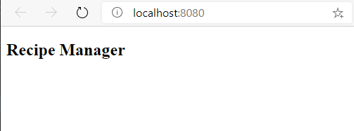

As highlighted in the overview of JSX, the core of React development is based around components. Components are self-contained units, designed for reuse and modularity. React projects will typically contain numerous components.

A component can either be a function or a class. Most React developers prefer using creating components with functions, and we will focus on this style. Most applications have one core component, commonly called `App`, which acts as the root of the application. We are going to start by creating our `App` component.

## Creating your first component

1. Open Visual Studio Code
1. Create a new file in **src** named **App.jsx**
1. Add the following code:

    ```javascript
    import React from 'react';

    function App() {
        return (
            <article>
                <h1>Recipe Manager</h1>
            </article>
        )
    }

    export default App;
    ```

### Exploring the code

We start by importing `React`, which allows us to use JSX syntax. We then create a function named `App`, like we would any other function in JavaScript. At the end we export the function using the standard JavaScript syntax.

The core of our component is contained in the `return` statement. Notice we are using HTML (or technically XML) embedded in JavaScript. This is the power of JSX. This allows us to use the logic and power of JavaScript as needed, and create self-contained units of work (or components).

The HTML returned by the function (or component) is what will be displayed on the page. The display will be a header containing the text **Recipe Manager**.

> ![NOTE]
> Notice the fact the `h1` element is contained inside an HTML 5 `article` element. Because JSX uses XML, we are required to always have one root element. `article` serves as the root for this component. This will allow us to add HTML and other React components as our application continues to grow.

## Updating our application to use our core component

Let's update our application to use our new component.

1. Open **index.jsx**
1. After the line which reads `import ReactDOM from 'react-dom';` (this should be line 3) add the following:

    ```javascript
    import App from './App';
    ```

1. Replace the initial message, which is the code which reads `<h1>Hello, world!</h1>` with a call to the `App` component:

    ```jsx
    <App />
    ```

### Exploring the code

The complete contents of **index.jsx** will now be the following:

```jsx
import React from 'react';
import ReactDOM from 'react-dom';
import App from './App';

ReactDOM.render(
    <App />,
    document.getElementById('app')
);
```

Our `import` statement imports our component using the same syntax we would for any other module. We are then able to use the component as if it were HTML.

> ![NOTE]
> Because JSX uses XML syntax, we are required to close the `App` tag. We can do this by either using the long-form syntax of `<App></App>`, or the "self-closing" short-hand of `<App />`. Both options are the same, but most developers use the short-hand option.

## See the results

Save all files. The browser will automatically refresh with the results!


