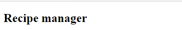

There are numerous ways to create a React app, with various bootstrap tools available. For our lesson we are going to use the most common, **create-react-app**, to create the infrastructure. The tool will add several starter files which we are going to remove (which you will notice many developers do with any templating tool). This will allow us to build from scratch to better understand how React works. We will start by setting up our application, and explore the code in the next unit.

1. Run **create-react-app** by using **npx**, then change directories into the new folder and open it with Visual Studio Code.

    ```bash
    npx create-react-app recipe-manager
    cd recipe-manager
    ```

    > !NOTE
    > [npx](https://medium.com/@maybekatz/introducing-npx-an-npm-package-runner-55f7d4bd282b) is the npm package runner, provided with npm version 5.2 or higher. It allows you to run packages without having to install them locally.

2. Run the site by using the **npm start** script.

    ```bash
    npm start
    ```

3. Clean up the files inside of the **src** directory. This is the directory we will use to add our code.

    ```bash
    # Windows
    cd src
    del *

    # macOS or Linux
    cd src
    rm -f *
    ```

4. Open the folder in **Visual Studio Code**. We do this by changing directories back to the root of our code (**good-dogs**), and then calling **code** from the command or terminal window.

    ```bash
    cd ..
    code .
    ```

5. Inside **Visual Studio Code**, create **index.js** in **src** which will become the core of our application. Return to Visual Studio Code. In the **src** folder, click **New File**, and name it **index.js**.

6. Add the following code to **index.js** to create a header to the application.

    ```javascript
    import React from 'react';
    import ReactDOM from 'react-dom';

    ReactDOM.render(
        <article>
            <h1>Recipe manager</h1>
        </article>,
        document.getElementById('root')
    );
    ```

    The two libraries we import (`React` and `ReactDOM`) are the core to libraries for React.

    The `render` method on `ReactDOM` accepts two parameters. The first is the HTML we wish to display on the page (`<h1>`) in our case. The second is the **id** of the HTML element used to host our application.

    Note the `article` element acts as our root element, complying with the restrictions from XML.

7. Open your browser and navigate to **http://localhost:3000**. You will be presented with your site!



## Exploring the HTML

When creating a React application you will often find the bulk of the HTML will be part of the JSX files you create rather than the HTML file itself. If you examine the HTML file in the **public** folder you will notice the root `div` element with the **id** of **root**. As mentioned earlier, this becomes the host for our application. The `h1` element in `render` is placed inside that `div`.
