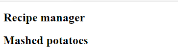

One of the core constructs in React is the component. A component is a self-contained unit of both work and display in React. A component will have its own display, data and state, and can be reused multiple times across your application. It also serves as a logical way of breaking up your application into smaller, easier to maintain parts.

The first component we will create will be for the title of the recipe. We will create a variable to demonstrate how we can display data dynamically in React.

## Display dynamic data

If you wish to display dynamic data inside a component you use the syntax `{ }`, sometimes known as handlebars. This style of syntax is relatively common with HTML templating tools. If you wanted to display the current time, you could use the following code:

```javascript
<div>{ Date.now() }</div>
```

## Creating a component

The most common way to create a component is to create an [ECMAScript 6 (ES6) class](https://developer.mozilla.org/en-US/docs/Web/JavaScript/Reference/Classes) which extends the React `Component`. The core function on `Component` is `render`, which performs a similar task to `ReactDOM.render` - it will return the HTML you wish to display as part of the component.

Components become similar to HTML elements; we can use them in JSX files in the same way we can use HTML. The key requirement is they must be declared before we can use them.

1. Return to **index.js**. Just below the line which reads `import ReactDOM from 'react-dom';`, which should be line 3, add the following code.

    ```javascript
    class RecipeTitle extends React.Component {
        render() {
            const title = 'Mashed potatoes';
            return (
                <h2>{ title }</h2>
            )
        }
    }
    ```

    Notice the `render` method returns an unordered list with a couple of items. This is similar to what we saw earlier with `ReactDOM.render`. We create a constant named `title`, which we then display inside an `h2` element by using the `{ }` syntax.

1. Let us update our site to use the component we just created. As highlighted before, the name of the component becomes just like an HTML element. The name is the same name as the class, `RecipeTitle` in our case. Inside `ReactDOM.render`, below the line which reads `<h1>Recipe Manager</h1>`, add the following code:

    ```javascript
    <RecipeTitle />
    ```

    The updated `ReactDOM.render` should look like the following:

    ```javascript
    ReactDOM.render(
        <article>
            <h1>Recipe Manager</h1>
            <RecipeTitle />
        </article>,
        document.getElementById('root')
    );
    ```

    >!NOTE
    > Because JSX is built upon XML, all elements must be closed. By using the `/>` at the end we indicate the element is "self-closing". This is short-hand for `<RecipeTitle></RecipeTitle>. It can be used whenever nothing needs to be placed between the start and end tags.

1. Return to your browser. The page should now be updated to display **Mashed Potatoes** under **Recipe Manager**. If it doesn't automatically update, hit refresh in your browser window.


