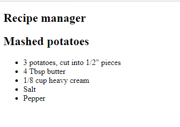

Because React is based on JSX, which is a combination of JavaScript and XML/HTML, we have the ability to generate HTML dynamically, fully integrated with our JavaScript.

Let us update our page to create a new component with a list of ingredients. We will see how we can display an array of items.

## Lists

Because your HTML is integrated with JavaScript in JSX, we rely on JavaScript for logic and looping. To display a set of items contained in an array, you typically use the `map` function. `map` is designed to create a new array of items based on the result of a function call. If we wanted to display a list of titles in an ordered list, we use both `map` and the `{ }` syntax we learned earlier.

1. Return to **index.js**. Just below the line which reads `import ReactDOM from 'react-dom';`, which should be line 3, add the following code.

    ```javascript
    class IngredientList extends React.Component {
        render() {
            // Create an array of ingredients
            const ingredients = [
                '3 potatoes, cut into 1/2" pieces',
                '4 Tbsp butter',
                '1/8 cup heavy cream',
                'Salt',
                'Pepper'
            ];

            // Create the list items using map
            const ingredientListItems = ingredients.map((ingredient, index) => {
                return (
                    // Return the desired HTML for each ingredient
                    <li key={index}>{ ingredient }</li>
                );
            });

            // return the HTML for the component
            // ingredientListItems will be rendered as li elements
            return (
                <ul>
                    { ingredientListItems }
                </ul>
            );
        }
    }
    ```

    We start by creating an array of strings to contain our list of `ingredients`. We want each ingredient to be displayed as a list item. We implement this by using `map`.

    As highlighted before, `map` behaves similarly to a for each statement. It will execute the function once for each item in the array. We want to display a collection of `li` HTML elements, so we return the appropriate JSX, with `{ingredient}` inside `li`.

1. Return to `ReactDOM.render`. Underneath the line which reads `<RecipeTitle />`, add the following:

    ```javascript
    <IngredientList />
    ```

    `ReactDOM.render` should now look like the following:

    ```javascript
    ReactDOM.render(
        <article>
            <h1>Recipe manager</h1>
            <RecipeTitle />
            <IngredientList />
        </article>,
        document.getElementById('root')
    );
    ```

1. Return to your browser. Refresh the page. You should now see the site updated to contain your list of ingredients.



The full contents of **index.js** should now contain the following:

```javascript
import React from 'react';
import ReactDOM from 'react-dom';

class IngredientList extends React.Component {
    render() {
        const ingredients = [
            '3 potatoes, cut into 1/2" pieces',
            '4 Tbsp butter',
            '1/8 cup heavy cream',
            'Salt',
            'Pepper'
        ];

        // Create the list items using map
        const ingredientListItems = ingredients.map(ingredient => 
            <li>{ ingredient }</li>
        );

        return ( // Generate the returned HTML
            <ul>
                { ingredientListItems }
            </ul>
        );
    }
}

class RecipeTitle extends React.Component {
    render() {
        const title = 'Mashed potatoes';
        return (
            <h2>{ title }</h2>
        )
    }
}

ReactDOM.render(
    <article>
        <h1>Recipe manager</h1>
        <RecipeTitle />
        <IngredientList />
    </article>,
    document.getElementById('root')
);
```
